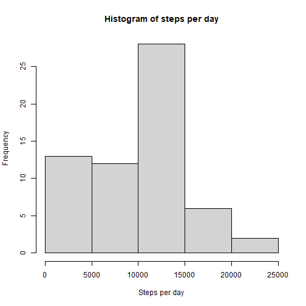
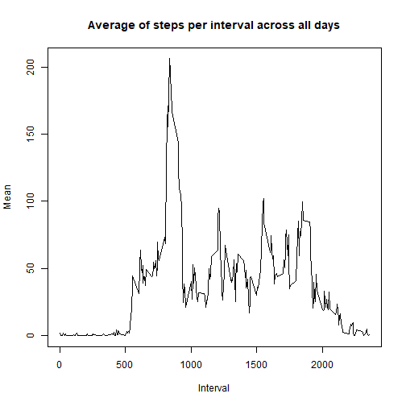
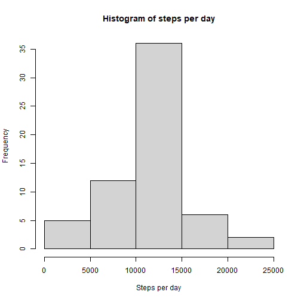
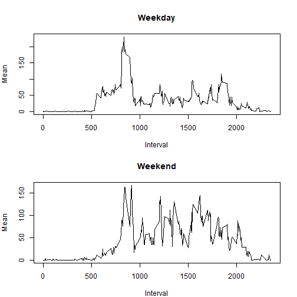

## Loading and preprocessing the data


```r
zipfile_path <- "activity.zip"
unzip(zipfile_path)
csvfile_path <- "activity.csv"
data <- read.csv(csvfile_path, header = TRUE, sep = ",")
data$factor_date <- factor(data$date)
data$date <- as.Date(data$date)
data$factor_interval <- factor(data$interval)
```

## What is mean total number of steps taken per day?


```r
perday <- tapply(data$steps, data$factor_date, sum, na.rm = TRUE)
hist(perday, main = "Histogram of steps per day", xlab = "Steps per day")
```



The mean of total steps per day is **9354.2295082**, and the median is **10395**.


## What is the average daily activity pattern?


```r
perinterval <- tapply(data$steps, data$factor_interval, mean, na.rm = TRUE)
plot(names(perinterval), perinterval, type = "l", main = "Average of steps per interval across all days", xlab="Interval", ylab="Mean")
```



The maximum average of steps is **206.1698113**, and occurs on index **104**, which corresponds to interval **835**.

## Imputing missing values

There are **2304** missing values in the *steps* column in the dataset.


```r
na_records <- which(is.na(data$steps) == TRUE)
na_records_interval <- data$interval[na_records]
new_data <- data
new_data$steps[na_records] <- perinterval[match(na_records_interval, as.numeric(names(perinterval)))]

new_perday <- tapply(new_data$steps, new_data$factor_date, sum, na.rm = TRUE)
hist(new_perday, main = "Histogram of steps per day", xlab = "Steps per day")
```



The mean of total steps per day is **10766.19**, and the median is **10766.19**. After imputing the missing values, the data distribution changed, reducing the days with counts between 0 and 5000, and increasing the ones between 10000 and 15000. Additionally, the mean and median became equal. 


## Are there differences in activity patterns between weekdays and weekends?


```r
values <- c("weekend", "weekday", "weekday", "weekday", "weekday", "weekday", "weekend")
new_data$class <- factor(values[as.POSIXlt(data$date)$wday + 1])

par(mfrow=c(2, 1), mar=c(4,4,4,2))

data_weekday = new_data[new_data$class == "weekday",]
perinterval_weekday <- tapply(data_weekday$steps, data_weekday$factor_interval, mean, na.rm = TRUE)
plot(names(perinterval_weekday), perinterval_weekday, type = "l", main="Weekday", xlab="Interval", ylab="Mean")

data_weekend = new_data[new_data$class == "weekend",]
perinterval_weekend <- tapply(data_weekend$steps, data_weekend$factor_interval, mean, na.rm = TRUE)
plot(names(perinterval_weekend), perinterval_weekend, type = "l", main="Weekend", xlab="Interval", ylab="Mean")
```



The plots show that the active time of the subject start later on weekends.

